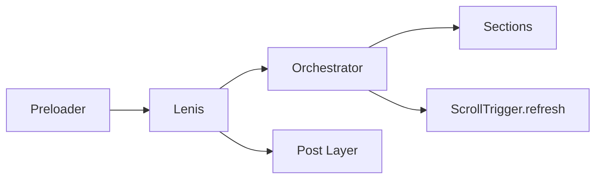

# ScrollForge v2

A **cinematic scroll-driven portfolio** built with GSAP ScrollTrigger, Lenis, and Vanilla JS — no framework overhead.

[](https://scrollforge.arvinebrahimi.dev)
[](./package.json)
[](./LICENSE)

## Live Demo

- **Production:** [scrollforge.arvinebrahimi.dev](https://scrollforge.arvinebrahimi.dev)
- **GitHub Pages:** [arvinebrahimi.github.io/ScrollForge](https://arvinebrahimi.github.io/ScrollForge/)

## V2 Highlights

| Layer | Features |
|-------|----------|
| **Architecture** | Scroll orchestrator, `gsap.context` teardown, lazy section init |
| **Global UX** | Progress nav, theme toggle, sound (opt-in), preloader, post-layer grain |
| **Hero 2.0** | Three.js particles (code-split), scramble text, depth parallax, showreel modal |
| **Sections** | Velocity marquee, pinned 3D/video, FLIP case studies, per-word reveal |
| **New** | Stats, process timeline, tech orbit, testimonials, contact form, footer |
| **Delight** | Cursor v2 + trail, keyboard nav (`J/K`, `?`), velocity skew, Konami easter egg |

## Tech Stack

- [GSAP 3](https://gsap.com/) + ScrollTrigger + ScrollToPlugin
- [Lenis](https://github.com/darkroomengineering/lenis) — smooth scroll synced to GSAP ticker
- [Three.js](https://threejs.org/) — hero particle field (dynamic `import()`)
- [Vite 5](https://vitejs.dev/) — build tool

## Quick Start

```bash
npm install
npm run dev      # http://localhost:5173
npm run build    # production build → dist/
npm run preview  # preview production build
```

### Keyboard Shortcuts

| Key | Action |
|-----|--------|
| `J` / `↓` | Next section |
| `K` / `↑` | Previous section |
| `Home` / `End` | First / last section |
| `?` | Shortcut help overlay |

### Easter Egg

Enter the Konami code (`↑↑↓↓←→←→BA`) to unlock the **Behind the Scenes** section.

## Architecture

```
src/
├── main.js                 # boot: preloader → lenis → orchestrator → globals
├── core/
│   ├── orchestrator.js     # section registry + lazy IntersectionObserver init
│   └── section-base.js     # withSectionContext() wrapper
├── sections/               # one init*() per scroll section
├── components/             # modals (case study, showreel)
├── webgl/                  # Three.js + canvas effects (code-split)
└── utils/                  # lenis, cursor, theme, sound, nav, skew, …
```



## Deploy

### Vercel (recommended)

Connect the repo — `vercel.json` handles SPA rewrites and asset caching.

### GitHub Pages

Push to `main` — `.github/workflows/deploy.yml` builds with `VITE_BASE_PATH=/ScrollForge/` and deploys to Pages.

### Custom base path

```bash
VITE_BASE_PATH=/scrollforge/ npm run build
```

## Quality

- **CI:** `.github/workflows/ci.yml` — build on every push/PR
- **Lighthouse:** `.github/workflows/lighthouse.yml` — Performance ≥ 85 gate
- **QA matrix:** [`docs/QA_MATRIX.md`](./docs/QA_MATRIX.md)

## Documentation

| Doc | Purpose |
|-----|---------|
| [`docs/PROJECT_SPEC.md`](./docs/PROJECT_SPEC.md) | V1 architecture spec |
| [`docs/V2_ADVANCED_TASKS.md`](./docs/V2_ADVANCED_TASKS.md) | V2 task plan (A01–A40) |
| [`docs/IMPLEMENTATION_TASKS.md`](./docs/IMPLEMENTATION_TASKS.md) | V1 tasks + V2 sign-off |
| [`docs/SHOWCASE.md`](./docs/SHOWCASE.md) | Portfolio showcase notes |

## Credits

- [GSAP](https://gsap.com/) — scroll-driven animation
- [Lenis](https://github.com/darkroomengineering/lenis) — smooth scroll
- [Three.js](https://threejs.org/) — WebGL particles
- Fonts: [Space Grotesk](https://fonts.google.com/specimen/Space+Grotesk), [Inter](https://fonts.google.com/specimen/Inter)

## License

MIT © [Arvin Ebrahimi](https://arvinebrahimi.dev)
